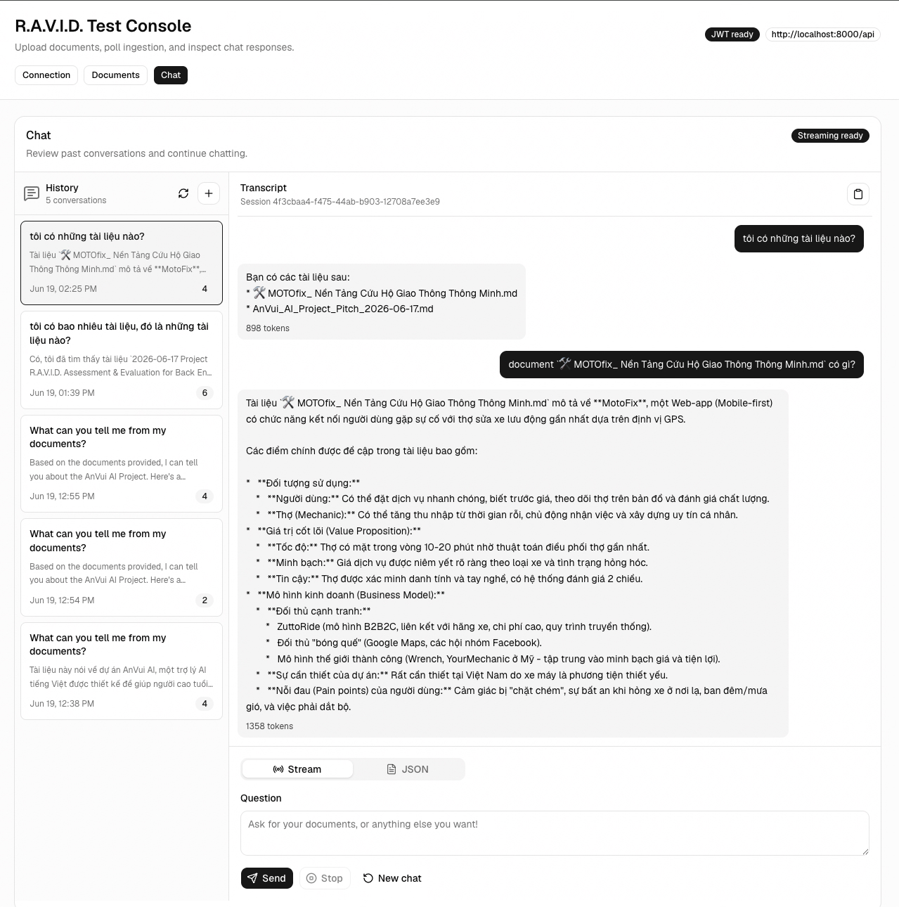

# Screenshot Chat


# R.A.V.I.D. Chatbot Backend

Take-home backend implementation for a private document knowledge base and RAG chatbot.

The backend uses Django REST Framework, JWT authentication, PostgreSQL, Redis, Celery, Flower, Chroma, LangChain, and OpenRouter. The React frontend in `../react-frontend` is a test console for registration/login, document upload, ingestion polling, chat history, JSON chat, and Server-Sent Events streaming.

## Architecture

```text
React test console
  -> Django REST API
      -> PostgreSQL: users, documents, chat sessions, messages
      -> Redis: Celery broker and result backend
      -> Celery worker: document parsing, chunking, embedding, vector ingestion
      -> ChromaDB: per-user vector collections
      -> OpenRouter: LLM answer generation
      -> Flower: Celery task dashboard
```

Key design choices:

- `accounts` owns email/password registration and JWT login.
- `documents` owns upload validation, ingestion status, text extraction, chunking, and vector indexing.
- `chat` owns RAG queries, chat continuation, chat history, and SSE streaming.
- Each user's vectors are isolated in a Chroma collection named `user_<user_id>_documents`.
- Uploaded documents support PDF, TXT, and Markdown.
- Docker named volumes keep uploaded media, Chroma data, PostgreSQL data, and model/cache files shared across backend services.

## Prerequisites

- Docker Desktop or Docker Engine with Docker Compose.
- Node.js and npm for the React test console.
- An OpenRouter API key for live LLM chat responses.

Document upload and ingestion can run without an OpenRouter key, but `/api/chat/query/` and `/api/chat/query/stream/` need `OPENROUTER_API_KEY` for live model responses.

## Quick Start: Entire Application

Run the backend fully in Docker, then run the frontend locally with Vite.

### 1. Start the backend stack

From the repository root:

```bash
cd django-backend
cp .env.example .env
```

Edit `.env` and set:

```bash
OPENROUTER_API_KEY=<your_openrouter_api_key>
OPENROUTER_MODEL=openrouter/auto
```

The Docker Compose file overrides backend service URLs to use Docker service names such as `db` and `redis`, so you do not need to change `DATABASE_URL` or Redis URLs for the full-Docker workflow.

Build and start all backend services:

```bash
docker compose up -d --build
```

Check service health:

```bash
docker compose ps
```

Expected services:

- `web`: Django API and Swagger docs on http://localhost:8000
- `db`: PostgreSQL on localhost:5432
- `redis`: Redis on localhost:6379
- `celery`: background ingestion worker
- `flower`: Celery dashboard on http://localhost:5555

Useful backend URLs:

- API base: http://localhost:8000/api
- Swagger UI: http://localhost:8000/api/docs/
- OpenAPI schema: http://localhost:8000/api/schema/
- Flower: http://localhost:5555

### 2. Start the React test console

In a second terminal, from the repository root:

```bash
cd react-frontend
cp .env.example .env
npm install
npm run dev
```

The frontend defaults to:

```bash
VITE_API_BASE_URL=http://localhost:8000/api
```

Open the Vite URL printed by `npm run dev`, normally:

```text
http://localhost:5173
```

Use the UI to:

1. Register or login.
2. Upload PDF, TXT, or Markdown documents.
3. Poll ingestion status until `SUCCESS`.
4. Ask questions in Chat.
5. Switch between Stream and JSON chat modes.
6. Click previous conversations in chat history to review saved transcripts.

## Backend Docker Commands

Start or rebuild the full backend:

```bash
docker compose up -d --build
```

Start without rebuilding:

```bash
docker compose up -d
```

View logs:

```bash
docker compose logs -f web celery
```

Open a Django shell:

```bash
docker compose exec web python manage.py shell
```

Create an admin user:

```bash
docker compose exec web python manage.py createsuperuser
```

Stop services but keep data volumes:

```bash
docker compose down
```

Reset all backend data, including PostgreSQL, uploaded files, Chroma vectors, and cache volumes:

```bash
docker compose down -v
```

## API Examples

The React frontend is the easiest way to test the workflow, but the same API can be tested with curl.

Register:

```bash
curl -X POST http://localhost:8000/api/register/ \
  -H "Content-Type: application/json" \
  -d '{"email":"example@gmail.com","password":"password123"}'
```

Login:

```bash
TOKEN=$(curl -s -X POST http://localhost:8000/api/login/ \
  -H "Content-Type: application/json" \
  -d '{"email":"example@gmail.com","password":"password123"}' \
  | python -c "import sys, json; print(json.load(sys.stdin)['token'])")
```

Upload a document:

```bash
curl -X POST http://localhost:8000/api/documents/upload/ \
  -H "Authorization: Bearer $TOKEN" \
  -F "file=@knowledge_base.pdf"
```

Check ingestion status:

```bash
curl "http://localhost:8000/api/documents/status/?task_id=<task_id>" \
  -H "Authorization: Bearer $TOKEN"
```

Ask a RAG question:

```bash
curl -X POST http://localhost:8000/api/chat/query/ \
  -H "Authorization: Bearer $TOKEN" \
  -H "Content-Type: application/json" \
  -d '{"query":"What is the cancellation policy?"}'
```

Continue a chat:

```bash
curl -X POST http://localhost:8000/api/chat/query/ \
  -H "Authorization: Bearer $TOKEN" \
  -H "Content-Type: application/json" \
  -d '{"chat_id":"<chat_id>","query":"Can you summarize that in one sentence?"}'
```

Stream a response with Server-Sent Events:

```bash
curl -N -X POST http://localhost:8000/api/chat/query/stream/ \
  -H "Authorization: Bearer $TOKEN" \
  -H "Content-Type: application/json" \
  -d '{"query":"What is the cancellation policy?"}'
```

List saved chat sessions:

```bash
curl http://localhost:8000/api/chat/sessions/ \
  -H "Authorization: Bearer $TOKEN"
```

Fetch a saved transcript:

```bash
curl http://localhost:8000/api/chat/sessions/<chat_id>/ \
  -H "Authorization: Bearer $TOKEN"
```

## API Documentation

This project uses `drf-spectacular`.

- Swagger UI: http://localhost:8000/api/docs/
- OpenAPI schema endpoint: http://localhost:8000/api/schema/
- Repository schema artifact: `openapi.yaml`

To regenerate `openapi.yaml` on the host while using the Docker backend environment:

```bash
docker compose run --rm -v "$PWD:/app" web \
  python manage.py spectacular --file openapi.yaml --validate
```

## Workflow

1. The user registers and logs in with email/password.
2. Login returns a JWT access token. Protected routes require `Authorization: Bearer <token>`.
3. The user uploads a PDF, TXT, or Markdown file.
4. Django stores document metadata in PostgreSQL and writes the uploaded file to the shared Docker media volume.
5. Django enqueues a Celery ingestion task through Redis.
6. Celery reads the uploaded file from the same shared media volume, extracts text, chunks content with LangChain's `RecursiveCharacterTextSplitter`, embeds chunks with Chroma's local embedding flow, and stores vectors in the user's isolated Chroma collection.
7. The status endpoint reports `PROCESSING`, `SUCCESS`, or `FAILURE` from the document row and Celery result.
8. Chat queries retrieve relevant chunks only from the authenticated user's collection, build a context-aware prompt, call OpenRouter, and store user/assistant messages.
9. Chat continuation uses `chat_id` to include recent conversation history.
10. Chat history endpoints let the frontend list previous sessions and reload saved transcripts.
11. The streaming endpoint uses the same RAG flow but returns token chunks as `text/event-stream`.

## Tests

Run backend tests inside Docker:

```bash
docker compose exec web python manage.py test
```

Run frontend checks from `../react-frontend`:

```bash
npm run lint
npm run build
```

The backend test suite covers:

- Registration, duplicate registration, login success/failure.
- JWT protection for document upload.
- Upload validation for PDF/TXT/MD only.
- Document status and ownership isolation.
- RAG chat behavior with mocked model calls.
- SSE behavior for the no-documents case.
- Chat session list/detail history and ownership isolation.

## Environment Variables

Important backend variables:

- `SECRET_KEY`: Django secret key.
- `ALLOWED_HOSTS`: allowed Django hosts.
- `CORS_ALLOW_ALL_ORIGINS`: local frontend CORS switch.
- `DATABASE_URL`: PostgreSQL connection string. Docker Compose sets this to `db`.
- `REDIS_URL`, `CELERY_BROKER_URL`, `CELERY_RESULT_BACKEND`: Redis/Celery configuration. Docker Compose sets these to `redis`.
- `MEDIA_ROOT`: uploaded file directory. Docker Compose sets this to `/app/media`.
- `CHROMA_PERSIST_DIR`: Chroma vector directory. Docker Compose sets this to `/app/chroma_db`.
- `OPENROUTER_API_KEY`: required for live LLM chat responses.
- `OPENROUTER_MODEL`: OpenRouter model slug.
- `OPENROUTER_BASE_URL`: OpenRouter API base URL.

Important frontend variable:

- `VITE_API_BASE_URL`: API root used by the React test console. Default: `http://localhost:8000/api`.

## Notes For Reviewers

- The backend is intended to run fully through Docker Compose.
- The frontend runs locally with Vite so the reviewer can visually test the complete workflow.
- Do not mix a local Django server with Docker Celery unless both processes share the same media and Chroma paths. The supported workflow is full Docker for backend services.
- The first document ingestion may take longer because Chroma downloads and caches local embedding assets in the shared `app_cache` volume.
